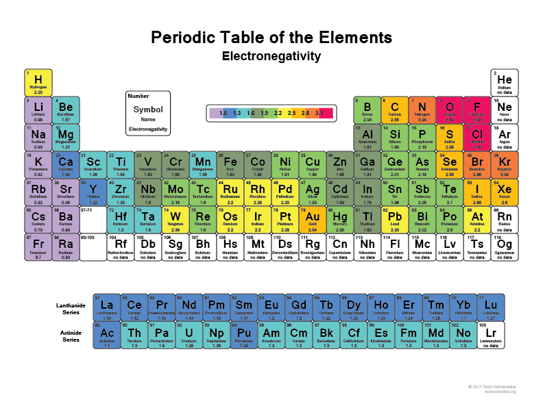
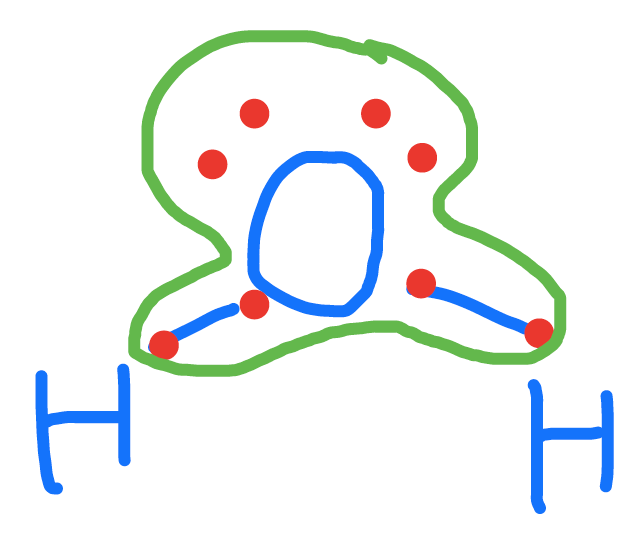
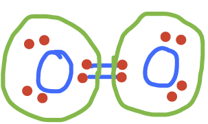

---
output:
  pdf_document: default
  html_document: default
---
# Life's secrets for storing energy

Much of the environmental and ecological engineering challenges are about dealing with too many suspended sediments and too many nutrients in surface and ground waters, and the consequences of too much organic matter and reduced compounds in aquatic ecosystems. We have also seen that these three challenges are inter-connected and related. Nutrients and organic matter are related because the former contain the needed atoms necessary to build living cell and organism structures, corresponding to *living organic matter*, while the latter generally refers to *dead organic matter* and/or the assemblage of molecules which at one point were part of a living organism.

This definition of the linkage between the two is hardly satisfying, however... When one looks at where the electrons are allocated on the important atoms, a much more unifying scheme appears. This chapter describes this unifying scheme.

## The five fundamental requirements of life

Before we dive down to the electron level, let us make sure we recognize that it is possible to simplify why there is, or not, life on our planet and the universe. Such a list includes:

- the presence of liquid water
- available nutrients that can fulfill the need for the six most numerous and important atoms that build most of our cell and organism structure: C, H, O, N, S, P. Without the commas comes this delightful acronym *CHONSP* which generations of students have come to love
- a source of energy, which in most cases is the form of solar or chemical energy
- electrons acceptor(s), without which chemical energy cannot be released
- and a suitable temperature range (about -5&deg;C to +50&deg;C) because of course most of living organisms will not live for very long outside this range 

There are many other requirements for life to occur, e.g., the ability to reproduce or even to die, but for what we are interested, this is a satisfying list. In this chapter, we will address the source of energy and what secret living organisms have found to store energy. Primary producers, which include most of chlorophyll containing plants from algae to [angiosperms](https://en.wikipedia.org/wiki/Flowering_plant) (flowering plants), have the ability to use solar radiations as a source of energy. An entire chapter is dedicated to this marvel. 

However, even for primary producers, solar radiations cannot be the sole source of energy, otherwise they would die at night... And for the rest of living organisms, solar radiations are just not a source of energy (merely a source of 'bien-être' or vitamin D for humans...!). So obviously, life has had to find a solution so that energy would be available for all conditions of light and temperature on earth.

The *first secret of life* is the ability to __store energy in the form of high energy electrons onto organic molecules__. Having a source of energy is always a good thing. However, energy can only be released if there is an outlet for it, otherwise it stays as potential energy. Practically, this means that the energy stored on organic molecules can and is only released when the electrons go from the high potential to a lower one, or in others words from *electron donors* (most of the time from organic molecules) to *electron acceptors*. 

This is *the second secret* of life on earth: on our planet exists this miracle molecule, O~2~, which acts as an  extremely powerful electron acceptor. So you have to imagine O~2~ less as a *gentle acceptor of electrons* that organic matter would be kind enough to *donate*, but more like a very *aggressive electron seeker* and any organic matter located close to oxygen runs the risk to be __[oxidized](#oxidation)__, that is to lose its electrons. Sometimes, I like to refer to O~2~ as the *electron kleptomaniac*. So in oxygenated environments such as earth's atmosphere and most water bodies, living organisms' only concern is to have potential energy available in the form of high energy electrons stored onto organic molecules, because this energy can easily be released at any time thanks to the very oxidizing agent O~2~. Chapter \@ref(aerobic-and-anaerobic-respiration) goes into the details of how this energy is released and transferred in cells.

## Electron allocation onto CHONSP

First, among the 6 atoms that form CHONSP, and this is true for all atoms except for [noble gases](https://en.wikipedia.org/wiki/Noble_gas) which are stable [monatomic atoms](https://en.wikipedia.org/wiki/Monatomic_gas), none of them exist as monatomic atoms: they always form bonds with other atoms to form molecules. Among the CHONSP, three of them are [homonuclear diatomic molecules](https://en.wikipedia.org/wiki/Diatomic_molecule), i.e., they can form molecules of two atoms of the same chemical element: H~2~ (dihydrogen, although it is most often referred to simply as hydrogen, which can be quite confusing), O~2~ (dioxygen, although oxygen is also most often used, unfortunately), and N~2~ (dinitrogen, which name is generally properly applied). Obviously, they can also bind to other elements, which is what we are about to see.

If indeed, on our planet floats a very oxidizing agent in the form of O~2~, then the **stable state of all other molecules should be where most other elements have lost all their electrons to oxygen**. And there ought to be techniques to see where the electrons are allocated on molecules. 

## Electronegativity as a powerful tool to allocate electrons

Chemists have created the __oxidation state__ (*OS*) or __oxidation number__ indicator which quantifies this electron allocation to some extent, but we find it to be rather confusing for our purpose of allocating or view where the electrons are Stored in molecules. More [discussion and information on Oxidation State](#oxidation-state) is available in the [glossary](#glossary) of this book.

We must first lock in the electronegativity concept. Electronegativity is a chemical property which describes how well an atom can attract an electron to itself. In the periodic table in Figure \@ref(fig:periodic-table), first observe that our CHONSP all belong to the non-metallic atoms. 

```{r "periodic-table", eval=TRUE, echo=FALSE, out.width = '100%', fig.align = 'center', fig.cap="Vibrant Periodic Table With 118 Elements. Obtained freely from https://sciencenotes.org/periodic-table-pdf-2/ "}
knitr::include_graphics("pictures/periodictable.png")
```

Second, all atoms are more or less electronegative. The most electronegative atom is F, fluorine. Electronegativity decreases towards the left and the bottom of the table as illustrated in Figure \@ref(fig:periodic-table-electroneg). For our CHONSP, ElecNeg~O~ > ElecNeg~N~ > ElecNeg~S~ > ElecNeg~C~ > ElecNeg~H~ > ElecNeg~P~. 

```{r "periodic-table-electroneg", eval=TRUE, echo=FALSE, out.width = '100%', fig.align = 'center', fig.cap="Periodic table of the elements with electronegativities shown. Obtained freely from https://sciencenotes.org/list-of-electronegativity-values-of-the-elements/ "}

```

If you look carefully in Figure \@ref(fig:periodic-table-electroneg) and in equation \@ref(eq:electroneg), you will see that the electronegativity of oxygen is 3.44, which is a lot greater than that of N (3.04), and the difference between N and C and S, is about 0.5. In other words, all the CHNSP stand no chance next to O: in any molecule which may involve CHNSP, the O atom will attract the electrons for itself. 


\begin{align}
O  \quad &>&   N  \quad &>& S \quad &>&  C \quad &>& H  \quad &>& P \\
3.44 \quad &>& 3.05  \quad &>& 2.58 \quad &>& 2.56 \quad &>& 2.30 \quad &>& 2.19
(\#eq:electroneg)
\end{align}


For example, in the H~2~O molecule, one can see in the [Lewis dot Structure](#Lewis-structure) below that by applying the electronegativity rule, the O atom has all the electrons for itself, while the 2 H, have none for themselves. Let us make sure that there is no confusion between the octet rule and the electronegativity. Atoms assemble into molecules so that their octet rules be fulfilled. So in the H~2~O molecule, yes each H shares an electron with the O and reciprocally. But, the **electronegativity** tells us which atom really has the electrons for itself. And that atom is O.

```{r "elecalloc-H2O", eval=TRUE, echo=FALSE, out.width = '25%', fig.align = 'center', fig.cap="Electron allocation on the water molecule following the electronegativity rule"}

```

We realize that the electron allocation can be quite confusing or a bit artificial at first, but we shall see in Chapter \@ref(the-classic-redox-sequence-of-wetland-soils) that it is fully corroborated with oxidation and reduction processes. You can now see in equation \@ref(eq:electroneg), that sulfur and carbon nearly have the same electronegativity, which is one of the reasons for the ease of formation of the [disulfur bridges](#disulfur-bridges) in proteins. Also notice that phosphorus has the lowest electronegativity of our CHONSP, and this is the reason why, as we shall see later, phosphorus stays in the oxidized form, even in organic molecules.

## Dioxygen: the 'electron kleptomaniac' molecule

Oxygen is a [homonuclear diatomic molecules](https://en.wikipedia.org/wiki/Diatomic_molecule), which means that it can form the diatomic molecule O~2~. The two atoms of Oxygen, having the same electronegativity, split the electrons, which means that each atom has 6 electrons for itself as shown in Figure \@ref(fig:elecalloc-O2). So if we summarize things, we have the most electronegative atom in the universe after Fluorine (Figure \@ref(fig:periodic-table-electroneg)) that is floating in most places on earth and in water essentially in a state (O~2~) where it really would rather have 8 rather than 6 electron for itself! **This is the reason why oxygen is the ultimate electron acceptor**, although a better representation might be to describe it as the ultimate 'electron kleptomaniac'. 


```{r "elecalloc-O2", eval=TRUE, echo=FALSE, out.width = '25%', fig.align = 'center', fig.cap="Electron allocation on the water molecule following the electronegativity rule"}

```

But let us be clear: the oxygen atom can **only** be an electron acceptor if it does not have 8 electrons for itself. The only two possibilities are 

- in the case of O~2~, for which each atom as 6 electrons for itself, 
- and the other possibility is for hydrogen peroxide $H-O-O-H$, where each oxygen atom have 7 electrons for themselves. 

Because oxygen is the most electronegative atom (after fluorine), in **all other molecules** where it is involved, oxygen will have 8 electrons for itself, and can therefore **never** accept more electrons. 

## Fully Oxidized forms of CNSP

On our planet, we have the luxury to 'bath' in an oxidized environment, which means among other things, that the oxygen atom will tend to attract all the electrons for itself when involved with CHNSP. Another way to look at it is to say that the stable state in an aerobic environment of the CHNSP atoms corresponds to molecules where the CHNSP atoms will have **zero electrons** for themselves.  Well, and guess what, there are not that many possibilities, in fact only one for each of the CNSP atoms! In Figure \@ref(fig:ElecAlloc-CO2-NO3-SO4-PO4) below, you can see that none of the CNSP atoms have electrons for themselves: they have all been taken by the oxygen atoms!

```{r "ElecAlloc-CO2-NO3-SO4-PO4", echo=FALSE, out.width = '25%', fig.show = 'hold', fig.align = 'center', fig.cap="Electron allocation on each of the C, N, S, and P atoms for the CO~2~, nitrate, sulfate, and phosphate molecules, showing that C, N, S, and P atoms have no electrons for themselves, or are fully oxidized, while Oxygen has 8, or is fully reduced"}
knitr::include_graphics(c("pictures/ElecAlloc_CO2.png","pictures/ElecAlloc_NO3-.png","pictures/ElecAlloc_SO42-.png","pictures/ElecAlloc_PO43-.png"))
```

As a result, these molecules are deemed as *stable* in an aerobic environment. This suggests that all other molecules containing CNSP are essentially unstable on our planet...?! Yes, you read it correctly, that is the case! Honestly, there is nothing new really as this has been written a long time ago, e.g., in the Christian Bible "you are dust and to dust you will return" (Gn 3:19). So we essentially have a reprieve on this planet, but so do all living creatures!! The secret of life has been to be able to create and maintain CNSP atoms with electron for themselves, very well 'knowing' that these electrons would eventually be stripped away by O~2~, but living organisms take advantage of this because the transfer of electrons generates energy (see Chapter \@ref(aerobic-and-anaerobic-respiration)). 

Notice that the suffix of the oxidized forms of N, S, and P, is *-ate*. The exception appears to be CO~2~, which is a gas while the *-ate* molecules are dissolved ions. However, the ionic forms of dissolved CO~2~ are [bicarbonate and carbonate](#carbonates), which suffix is *-ate*. So everything is logical in the end. 

To be complete, all the fully oxidized forms of CNSP, may lose of gain protons H^+^ depending on the pH. It turns out that for the pH range encountered in most natural waters (3.5 < pH < 9), only the carbonates and the phosphates may have different molecular formulae. So the fully oxidized forms of C in inorganic molecules are illustrated in Figure \@ref(fig:ElecAlloc-CO2-to-CO32-) below ([aditional details available in the glossary](#carbonates)):

```{r "ElecAlloc-CO2-to-CO32-", echo=FALSE, out.width = '22%', fig.show = 'hold', fig.align = 'center', fig.cap="Electron allocation on each of the fully oxidized forms of C, including from left to right CO~2~, carbonic acid, hydrogen carbonate (or bicarbonate), and carbonate, showing that the C atoms have no electrons for themselves"}
knitr::include_graphics(c("pictures/ElecAlloc_CO2.png","pictures/ElecAlloc_H2CO3.png","pictures/ElecAlloc_HCO3-.png","pictures/ElecAlloc_CO32-.png"))
```

The fully oxidized forms of P in inorganic molecules are illustrated in Figure \@ref(fig:ElecAlloc-H3PO3-to-PO43-) below ([aditional details available in the glossary](#phosphate)):

```{r "ElecAlloc-H3PO3-to-PO43-", echo=FALSE, out.width = '22%', fig.show = 'hold', fig.align = 'center', fig.cap="Electron allocation on each of the fully oxidized forms of P, including from left to right Phosphoric acid, dihydrogen Phosphate, hydrogen phosphate, and phosphate , showing that the P atoms have no electrons for themselves"}
knitr::include_graphics(c("pictures/ElecAlloc_H3PO4.png","pictures/ElecAlloc_H2PO4-.png","pictures/ElecAlloc_HPO42-.png","pictures/ElecAlloc_PO43-.png"))
```


## Oxidation versus Reduction

But if O~2~ wants electrons so badly from any atom, how come all living creature do not just turn into 'dust', i.e., carbon dioxide, nitrate, sulfate and phosphate, all the time and manage to live at all?? A minimum 'energy obstacle' must be overcome for electrons to be transferred: this is referred to as the [activation energy](#generating-energy-transfer-of-electrons) (see Chapter \@ref(aerobic-and-anaerobic-respiration)). This obstacle is overcome during combustion: the high temperature of a flame self propagates the transfer of electrons from organic matter to O~2~. Chapter \@ref(aerobic-and-anaerobic-respiration) provides in great details how living organisms manage to allow enough transfer of electrons to generate energy, without turning into 'dust' at once like in combustion. Yet, when an organism dies, all the electrons stored onto the organic molecules are eventually taken by oxygen in an aerobic environment.

We have now established that oxygen eventually takes all electrons, but for that to happen, a minimum energy obstable must be overcome. This opens the possibility for CNSP to, at least temporarily, have electrons for themselves. This also opens the possibility to an infinite number of possible combinations of CHONSP assemblages in nature.

Before we get there though, it is time to establish some important terms. The fact that the oxygen atom tends to strip all electrons for itself is referred to as **oxidation**. This terms comes from the early days of chemistry referring to reactions where oxygen was involved. We now know that oxygen is not necessarily the only one involved in loss of electrons. By extention, any atom which **loses** electrons, not necessarily to O~2~, is said to be **oxidized**. Reversely, an atom which **gains electrons** is said to be **reduced** or to undergo **reduction**. This term also comes from the early days of chemistry when [Antoine Lavoisier (1743–1794)](https://en.wikipedia.org/wiki/Antoine_Lavoisier) observed that the weight of a heated metallic ore diminished due to the loss of dioxygen as a gas; and the metallic ore appeared *reduced* in size and in weight [@Wikipedia_contributors2018-dg]. We now know that this corresponds to the acquisition of electrons, hence the word *reduction* for the gain of electrons.

Several mnemonics exist in English to associate electron loss/gain with oxidation/reduction: 

- LEO (Loss of Electrons is Oxidation) the lion says GER (Gain of Electrons is Reduction)!
- OIL RIG: Oxidation Is Loss (of electrons) Reduction Is Gain (of electrons)

When oxygen takes electrons from another atom, we say that oxygen has been **reduced**, while the other atom has been **oxidized**. An oxidation is **necessarily** accompanied with a reduction, as electrons do not 'float' in solution like protons do. When the CNSP atoms have lost all their electrons like in Figure \@ref(fig:ElecAlloc-CO2-NO3-SO4-PO4), we say that the CNSP atoms are *fully oxidized*. *Fully reduced* atoms have 8 electrons for themselves, as is the case for oxygen in carbon dioxide (and carbonates), nitrate, sulfate, and phosphates. 

This suggests that between *fully oxidized* and *fully reduced*, there might be cases where atoms are *partially* oxidized and reduced.

## A gradient of oxidation and reduction states on inorganic and organic molecules

Indeed, whether CNSP atoms have 1, 2, etc. to 8 electrons for themselves, they will form very different molecules. It is now time to define what organic vs. inorganic molecules are. The term *organic molecule* finds its roots in *[vitalism](https://en.wikipedia.org/wiki/Vitalism)*, where it was believed that the elements entering in the composition of living organisms had to be different to the ones that made *inanimate* things. The term *organic* has remained and a more modern definition is that an organic molecule is a molecule where there is at least one $C-C$ bond. The best definition of an inorganic molecule is a molecule that is *not organic*.

One of the most important things to understand and learn in this part is that it is the electron allocation which essentially defines what a molecule will be. For example, molecules such as carbon dioxide CO~2~ and methane CH~4~ are quite different, one involves oxygen, the other hydrogen atoms. But in reality, one can make sense of the difference by looking at how many electrons the C has for itself. When C has zero electrons for itself, this means that some other electrons have stolen all the electrons from C, and there are not that many possibilities out there. The obvious solution is O=C=O or CO~2~ and the [carbonates](#carbonates) (Figure \@ref(fig:ElecAlloc-CO2-to-CO32-)). 

For the record, there are at least two other inorganic molecules that exist out there for which C has zero electrons for itself, but they are, relatively, in minuscule quantities : cyanate (N&equiv;C-O^-^) and carbon tetrachloride (CCl~4~). So it is fair to say the 'only' molecules with zero electrons is CO~2~ and carbonates for environmental and ecological applications. Reversely, the only molecule with 8 electrons for itself is a molecule where all the other atoms bound to the C atom give their electrons away. The only atom that will do this is hydrogen, so the only possible molecule with a C atom is methane CH~4~. 

In other words, it is quite interesting to look at molecules from the stand point of the number of electrons atoms have for themselves, and conclude on the different possibilities of molecules. Obviously, the examples of CO~2~ and CH~4~ are simplistic because they are simple inorganic molecules. Two other simple examples but that matter very much in our field, are nitrate vs. ammonium, and sulfate vs. sulfide. S and N in Sulfate and nitrate having no electron for themselves, the obvious electron 'stealer' is oxygen, hence the NO~3~^-^ and SO~4~^2-^ formulae. In NH~4~^+^ and H~2~S, the S and N have 8 electrons from themselves (Table \@ref(tab:ElecAllocTab)) and naturally, hydrogen atoms are providing electrons. 

Overall, across organic and inorganic moelecules, there is an entire gradient of [oxidation states](#oxidation-state) or number of electrons allocated on the C, N, and S (Table \@ref(tab:ElecAllocTab)). Notice that I purposely ommitted to mention P here, because the only form of P relevant for environmental and ecological engineering are the phosphates. And we have seen that in the phosphate molecules, P always has zero electrons for itself. It is therefore **always** in an oxidized form (Figure \@ref(fig:ElecAlloc-H3PO3-to-PO43-)). 

Table \@ref(tab:ElecAllocTab) summarizes a gradient of electron allocations, or a gradient of oxidation and reduction states, on the CNSP atoms. It is important to notice several things:

- Carbon is the only atom with a variable number of electrons in organic molecules
- N, and P, **always** have 8 electrons for themselves in *organic* molecules
    - This suggests that carbon is quite a variable of adjustment for electron 'acquisition' and  'donation'
    - This is why C is the atom on which photosynthesis can store, as the first step, electrons, and not any other atom
    - Because C can adjust so easily, reversely, N and S, although in a fully reduced state in organic molecule, will just not give their electrons in an environment where C can do that for them first. As a result, and this is crucial for our field, the byproduct of the oxidation of organic matter in respiration (details in Chapter \@ref(aerobic-and-anaerobic-respiration)) are reduced and are NH~4~^+^ and H~2~S, as they *do not* get oxidized during [heterotrophic](#trophic-names) respiration.
- Notice that only in inorganic molecules, do the N and S, have variable oxidation states, or number of allocated electrons on them. 
- Nitrite has two electrons for itself, and is highly unstable in aerobic environments, as oxygen will try to steal its electrons. 
- [Sulfur dioxide and sulfite](#sulfites) also are in very small quantities in the atmosphere (SO~2~) or in water as HSO~3~^-^ (not represented in Table \@ref(tab:ElecAllocTab)) and SO~3~^2-^, as both will readily be oxidated in sulfuric acid and sulfate.
- Notice that N~2~ has 5 electrons for itself, which is quite a lot and, therefore, potentially is an important electron donor. However, the triple bond N&equiv;N is very difficult to break and O~2~ does not, even at high temperatures. As a result, N&equiv;N is an inert or *unreactive* gas, although it makes for about 78% of earth's atmosphere. Nitrogen in N~2~ is thus referred to as **_unreactive nitrogen_**. 
    

```{r "ElecAllocTab", echo=FALSE, warning=FALSE}
elecalloc<-read.csv("ElecAlloc1.csv", header = TRUE)
library(kableExtra)
knitr::kable(elecalloc, align = "c", "html",
             caption = 'Examples of electron allocations on the C, N, S, and P atoms generating different inorganic and organic molecules relevant to environmental and ecological engineering',
             col.names = c("Nb of e^-^ stored on the atoms","C","N","S","P")) %>%
      kable_styling(full_width = F) %>%
  column_spec(1, bold = T, border_right = T, width = "5em") %>%
  column_spec(2, width = "15em") %>%
  column_spec(3, width = "10em") %>%
  column_spec(4, width = "10em") %>%
  column_spec(5, width = "10em", border_right = T) %>%
  row_spec(1:9, background = "white")
```

## Examples of electrons stored on organic molecules

Not convinced, yet? Let us take the example of glucose. Glucose is the result molecule of photosynthesis, where electrons have been stored onto the carbon atoms, which originally contained none as the *nutrient* from which glucose molecule is assembled is CO~2~. How can one see this? In the equation \@ref(eq:CO2-glucose)! Additional details on [redox half-reactions](#redox) are provided in the glossary. What is important to see here is that:

- 24 electrons are necessary to built glucose from CO~2~
- that these 24 electrons originally come from the oxygen atom of H~2~O
- that as oxygen atoms from water lose electrons, they form O~2~, where each atom has only 6 electrons for itself (Figure \@ref(fig:elecalloc-O2))

\begin{align}
6\,CO_2 + 24\,H^+ + 24\,e^- & \rightleftharpoons & C_6H_{12}O_6 + 6\,H_2O\\
12\,H_2O & \rightleftharpoons & 6\,O_2 + 24\,H^+ + 24\,e^-\\
& &\\
\hline\\
6\,CO_2 + 6\,H_2O & \to & C_6H_{12}O_6 + 6\,O_2
(\#eq:CO2-glucose)
\end{align}

After what we have said about oxygen and its prepensity to steal all electrons, why would it suddenly give electrons to C to form glucose? Indeed, there is some magic involved and it is called **[photosynthesis](#photosynthesis)**! For this to happen,  magic catalysts able to steal the electrons from oxygen of H~2~O, and a lot of energy captured in the form of light are necessary! 

And indeed in the end, thanks to the electron allocation concept, it is possible to visualize onto the glucose molecule where the electrons are as illustrated in Figure \@ref(fig:ElecAlloc-glucose). 

```{r "ElecAlloc-glucose", echo=FALSE, out.width = '40%', fig.align = 'center', fig.cap="Electron allocation on the glucose molecule showing that the C atoms have 3 to 5, and an average of 4 electrons for themselves"}
knitr::include_graphics(c("pictures/ElecAlloc_glucose.png"))
```

So, hopefully you are now convinced thanks to both the equations and Figure \@ref(fig:ElecAlloc-glucose) that indeed electrons are stored onto organic molecules! Notice that four of the C atoms have 4 electrons for themselves, while one has 3 and the last one has 5. On average though, each atom has 4. This actually is quite interesting as it corresponds to the number of electrons C has on its free form. This means that photosynthesis is not 'trying' to store more electrons than what it has in its free form: this is probably a lot more efficient than if it tried to store 6 like for the lipids (see Table \@ref(tab:ElecAllocTab) and Chapter \@ref(molecular-families)), and yet provides an opportunity to store a lot of electrons.

Let us take another example with cysteine, which also has N and S atoms in it. You can see in Figure \@ref(fig:ElecAlloc-cysteine) that the N and S atoms have 8 electrons for themselves, while the C atoms have 1, 4 and 5 electron for themselves. Cysteine has thus stored a total of 28 electrons for a total of 5 CNS atoms or 40% more electrons per atom than glucose. 

```{r "ElecAlloc-cysteine", echo=FALSE, out.width = '40%', fig.align = 'center', fig.cap="Electron allocation on the cysteine molecule showing the number of electrons stored on the C, N and S atoms "}
knitr::include_graphics(c("pictures/ElecAlloc_cysteine.png"))
```

For an alga who would use nitrate, sulfate and bicarbonates as its nutrients and which would need to [anabolize](#anabolism) cysteine, it would require to find 28 electrons **and** energy to assemble cysteine, as no electrons come with the nutrients listed here. Interestingly, the electrons stored on N and S are not useful as a source of electrons in the [respiration chain](#aerobic-and-anaerobic-respiration) of [heterotrophic](#trophic-names) respiration. But the N and S atoms, which respectively appear as amine (-NH~2~) and thiol (-SH) radicals for cysteine in Figure \@ref(fig:ElecAlloc-cysteine) play a central role in the formation and information molecules which contain N and S have for the cell. This is what the next chapter is going to show.

The last example is ATP ([Adenosine TriPhosphate](#ATP)), illustrated in Figure \@ref(fig:ElecAlloc-ATP). You can see that there are lots of red dots on the triphosphate side of the molecule, and see that phosphorus has zero electrons for itself...! Chapter \@ref(aerobic-and-anaerobic-respiration) details the reasons how and why ATP carries energy. But here, one can see that surely, it is not thanks to electrons on P, since there are none! The triphosphate chain is bound to a ribose, itself bound to an adenine. Ribose + Adenine is called adenosine. On ribose, each carbon stores an average of 4 electrons like all carbohydrates. There are lots of electrons stored on the 5 atoms of nitrogen on adenine. But these are not used for generating energy in the respiration chain. The large number of N atoms and electrons seem to be associated with highly valued molecules as ATP certainly is. 

```{r "ElecAlloc-ATP", echo=FALSE, out.width = '90%', fig.align = 'center', fig.cap="Electron allocation on the ATP molecule showing the number of electrons stored on the C, N, and P atoms "}
knitr::include_graphics(c("pictures/ElecAlloc_ATP.png"))
```

Last but important point. It is possible that some of you are still wondering why the electrons on oxygen are not counted as the number of electrons stored on molecules, and particularly on organic molecules. Oxygen, outside of the O~2~ molecule, really 'steals' electrons from all other atoms, as we have now repeated quite a few times. So when these molecules are [anabolized](#anabolism) from molecules such as carbonate, nitrate, sulfate or phosphate, each oxygen atom is already loaded with 8 electrons. So, it cannot accept any additional ones. So each oxygen atom in organic and inorganic molecule, is not bringing any electron 'to the table'. The only changes can occur on the C, N, and S atoms.

## Summary on electron allocations

This concludes the chapter on electron allocation, and the first introduction to oxidation and reduction. We have learned that using the electron allocation rooted in the electronegativitiy concept, it is possible to visualize where the electrons are stored and realize that in the vast majority of the time:

- oxygen steal all electrons for itself and is fully reduced, unless it is in the form of O~2~, where it become very 'hungry' for electrons
- hydrogen being less electronegative, always gives its electron to CONS atoms
- Life's secret to storing energy boils down to having high energy electrons stored on C, N, and S atoms, although only the C atoms are the ones that easily accept or donate electrons.
- Phosphorus almost always remains as in the fully oxidized forms of phosphates (or polyphosphates), even when incorporated in organic molecules as we shall see in the next chapter. This is due to the fact that phosphorus' electronegativity is lower than that of hydrogen. Phosphate plays a crucial role in energy conveyance, however, thanks to the  [pyrophosphate](#atp-or-the-energy-currency-of-the-cell) bond.

The next step consists in presenting where and why organisms need N, S, and P, to build their structure. The next chapter presents the four molecular families with which all organisms, and therefore organic matter, are assembled. 

