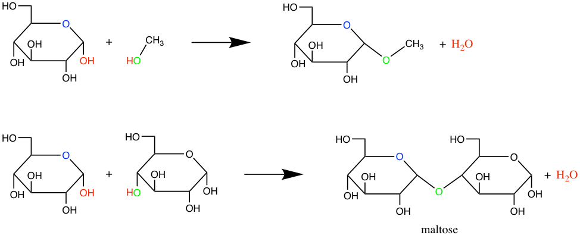
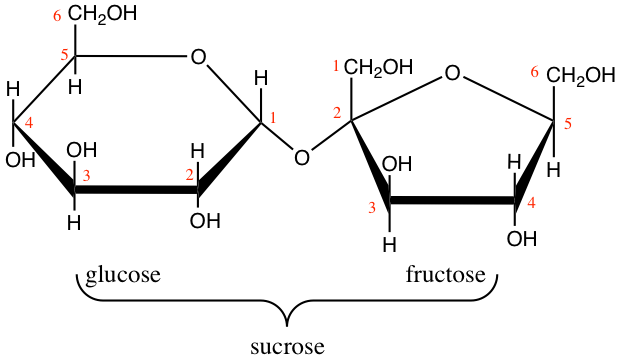
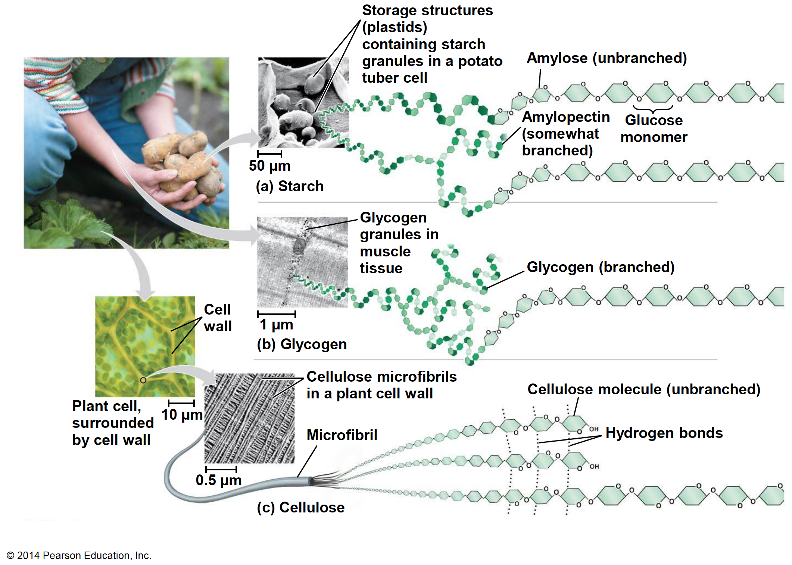
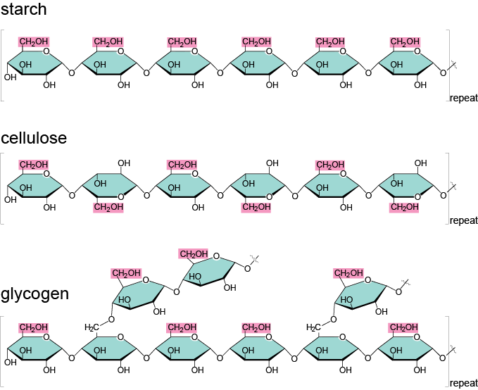

---
output:
  pdf_document: default
  html_document: default
---
# Life's secrets to make complex organic molecules{#molecular-families}

## Polymers of simple monomers

When scientists of the 18^th^ century observed nature, they thought there had to be major differences between *animated* organisms and the *inanimate* ones. In fact they thought that the elements at the basis of the animated vs. inanimate things had to be different. One can only wonder at the incredible diversity and complexity of forms between a bacterium and humans, and between unicellular algae and sequoia trees! And yet, despite the incredible variations of life forms and sizes, there is a common theme: very complex organic molecules are **polymers of relatively simple monomers**.

In the image of a brick wall and the skyscraper in Figure \@ref(fig:brickwall), it is possible to make a small wall or a huge skyscraper. Brick walls are made of bricks **and** of mortar to hold the bricks together. If one adds metal pieces, wood, etc. the complexity of the final product can be infinite, yet it is made from simple elementary pieces.

```{r "brickwall", echo=FALSE, out.width = '40%', fig.show = 'hold', fig.align = 'center', fig.cap="Small and large structures can be built from the addition of bricks, one at a time"}
knitr::include_graphics(c("pictures/brickwall.png","pictures/brick-skyscraper.jpg"))
```

Living organisms are essentially made of very complex polymers, but which are all built from simple monomers. Just like in a building which complexity results from the assemblage of different types of material, e.g., bricks, wood, metal, etc., living organisms are assembled from distinct 'types of molecules'. Among the very complex organic polymers, one can distinguish four **molecular families** (in addition to what we refer to as co-enzymes), where in each family, there is a repeated pattern. A molecular family can be defined as

- polymers of *similar* monomers *within* a family but *distinct between* families
- a mortar or chemical bonds which binds monomers together

The four molecular families that make organic molecules include:

- Carbohydrates
- Proteins
- Nucleic acids
- Lipids

## Carbohydrates

Carbohydrates form the entry molecules onto which electrons are first stored in [photosynthesis](#photosynthesis), and precisely on the carbon atoms. The generic formula for carbohydrates is (CH~2~O)~n~, and each atom, on average, has 4 electrons for itself as illustrated in Figure \@ref(fig:elecalloc-CH2O). We have seen in the previous chapter that having 4 electrons stored on each C is probably the most cost effective way to store many electrons on organic molecules. 

```{r "elecalloc-CH2O", echo=FALSE, out.width = '20%', fig.align = 'center', fig.cap="Electron allocation of a generic carbohydrate (CH~2~O)~n~"}
knitr::include_graphics(c("pictures/ElecAlloc_CH2O.png"))
```

### Monosaccharides

The monomers of carbohydrates are called **monosaccharides** (from Greek *monos*, i.e., single, and *sacchar*, sugar) or sometimes called *simple sugars* or *oses* (from the Latin "full of, abounding in, having qualities of"). The monomers that are assembled into complex polymers generally are hexoses, that is that they have 6 carbons, and are isomers of glucose. However, monosaccharides do include more than just hexoses or C~6~H~12~O~6~, and it is important to present them in general, and not just the monomers of *poly*saccharides.  

Most monosaccharides are made of 3 to 6 carbons (there actually are C7 to C9 oses) and are classified in *aldoses* or *ketoses*, depending on whether they have a *aldehyde* (-CHO) on their C#1 or a *ketone* (C=O) radical, usually on the carbon numbered #2. They either exist in linear chains and are then represented in [Fischer projection](#structural-formula) like in Figures \@ref(fig:aldoses) and \@ref(fig:ketoses), or, for pentoses (C5) and hexoses (C6), exist in cyclic chains (Figures \@ref(fig:riboses) and \@ref(fig:glucose-fructose)). Carbohydrates have been given a lot of codes and naming conventions and it is hard to avoid them if we want to put things together. So, do not be scared by all the names and letters used to describe and differentiate carbohydrates. The goal is:

- to realize the large diversity of monosaccharides
- to realize that the differences between, e.g., the hexoses are of steric consideration, i.e., which side are the hydroxyl (-OH) groups are of the linear chain, right or left. 
- to realize that C5 and C6 carbohydrates alternate between chain and cyclic molecular configurations. The cyclic form prevails for the functions of transport and structure that the carbohydrates provide. The chain form is the form needed for the release of electrons and energy. Both forms interchange freely for monosaccharides.

```{r "aldoses", echo=FALSE, out.width = '100%', fig.align = 'center', fig.cap="classification of C3 to C6 aldoses in Fischer projection. Triose : (1) D-(+)-glyceraldehyde ; Tetroses : (2a) D-(−)-erythrose ; (2b) D-(−)-threose ; Pentoses : (3a) D-(−)-ribose ; (3b) D-(−)-arabinose ; (3c) D-(+)-xylose ; (3d) D-(−)-lyxose ; Hexoses : (4a) D-(+)-allose ; (4b) D-(+)-altrose ; (4c) D-(+)-glucose ; (4d) D-(+)-mannose ; (4e) D-(−)-gulose ; (4f) D-(−)-idose ; (4g) D-(+)-galactose ; (4h) D-(+)-talose. after Yikrazuul — personal work, public Domain, https://commons.wikimedia.org/w/index.php?curid=4030124  "}
knitr::include_graphics(c("pictures/aldoses+nb.png"))
```

<br/>

Time to incorporate some jargon. When in the chain form necessary for the carbons to donate their electrons, monosaccharides are called **[reducing sugars](https://en.wikipedia.org/wiki/Reducing_sugar)**. This means that they are able to donate their electrons, to drive respiration and the generation of energy in the cell (details in Chapter \@ref(aerobic-and-anaerobic-respiration)). So, despite the fact that each carbon atom on monosaccharides has 4 electrons to give, potentially, this does not systematically happen. Strange, is it not? Indeed, for the pentoses and hexoses to be *reducing sugars*, they must be in the aldose form, or have a free aldehyde at the end of their chain or on carbon #1. So this rules out the ketoses? Actually no, the ketoses in the chain form can be readily  *[tautomerized](https://en.wikipedia.org/wiki/Tautomer)* into aldoses. This is only important to explain some of the differences in disaccharides.

<br/>

```{r "ketoses", echo=FALSE, out.width = '50%', fig.align = 'center', fig.cap="classification of C3 to C6 ketoses in Fischer projection. Triose : (1) dihydroxyacetone ; Tetrose : (2) D-erythrulose ; Pentoses : (3a) D-ribulose ; (3b) D-xylulose ; Hexoses : (4a) D-psicose ; (4b) D-fructose ; (4c) D-sorbose ; (4d) D-tagatose. after Yikrazuul — personal work, public Domain, https://commons.wikimedia.org/w/index.php?curid=6603584 "}
knitr::include_graphics(c("pictures/ketoses+nb.png"))
```

You might wonder what the D-(+) or D-(-) might mean in the legends of Figures  \@ref(fig:aldoses) and \@ref(fig:ketoses)... This is due to [optical rotation properties](https://en.wikipedia.org/wiki/Optical_rotation) that a pure solution of a particular ose has because of the asymmetry of the molecules. The different forms of hexoses in, e.g., Figure \@ref(fig:aldoses) are called [eniantiomers](#https://en.wikipedia.org/wiki/Enantiomer). D means that the hydroxyl group on the C#~n-1~ to the right of the molecule and most natural oses tend to be D (few oses have it on the left, in which case they are coded as L). The (+) or (-) tell whether the light rotation is pulled towards positive or negative angles. OK, lots of terms here, mostly to quench some of the curiosity of the biochemist in you.

Now that we have a more holistic view of what monosaccharides are made of, for all our purposes, we will reduce all this great variability to a few of them, which are glyceraldehyde (C3), ribose and deoxyribose (C5), and, glucose and fructose (C6). Glyceraldehyde is an important intermediate molecule of photosynthesis. 

```{r "glucose-fructose", echo=FALSE, out.width = '25%', fig.show = 'hold', fig.align = 'center', fig.cap="Cyclic structure or Haworth projection of alpha-D-glucopyranose (alpha-D-glucose; left) and beta-D-fructofuranose (beta-D-fructose; right)"}
knitr::include_graphics(c("pictures/glucose-haworth.png","pictures/blank.png","pictures/fructose-haworth.png"))
```

As previously mentioned, pentoses and hexoses have the tendency to form cyclic or ring molecules 'through a nucleophilic addition reaction between the carbonyl group and one of the hydroxyls of the same molecule. The reaction creates a ring of carbon atoms closed by one bridging oxygen atom' [@Wikipedia_contributors2018-li]. The most common rings are made of 5 or 6 atoms, respectively with four C atoms **and** one O atom, and, five C atoms **and** one O atom (cyclic forms also referred to as *furanose* and *pyranose*, respectively, because they closely resemble [furan](https://en.wikipedia.org/wiki/Furan), and [pyran](https://en.wikipedia.org/wiki/Pyran) rings). In Figure \@ref(fig:glucose-fructose), both glucose and fructose are hexoses. But fructose generally forms furanose rings (5 atoms, including one oxygen atom), while glucose forms pyranose rings. The &alpha; and &beta; correspond to whether the hydroxyl on the C#1 atom is below (&alpha;) or above (&beta;) the plan made by the ring. Some more jargon here added for exactness of information only.

```{r "riboses", echo=FALSE, out.width = '25%', fig.show = 'hold', fig.align = 'center', fig.cap="Cyclic structure of beta-D-Ribofuranose (beta-D-ribose) and 2-deoxyribose "}
knitr::include_graphics(c("pictures/ribose-haworth.png","pictures/blank.png","pictures/deoxyribose-haworth.png"))
```

Ribose and deoxyribose are the most important pentoses we need to know as they constitute one of the three ensembles that constitute [nucleotides](#Nucleic-acids), i.e., the monomers of nucleic acids. They both exist either in furanose or pyranose forms, although the furanose form dominates, but the difference between ribose and deoxyribose is the missing oxygen atom on the C2' atom (Figure \@ref(fig:riboses)). And yes, you guessed it right, this difference is the reason for the 'R' and 'D' in the RNA and DNA molecules. Notice that the carbon atoms are numbered in Figures \@ref(fig:glucose-fructose) and \@ref(fig:riboses). The numbers are 'primed' for the ribose and deoxyribose (Figure \@ref(fig:riboses)). This is a convention that geneticians have used to differentiate the carbons from the pentose to those of the base in nucleotides (see part on [nucleic acids](#nucleic-acids)). This is anecdotal information again.

Now, as the pentoses and hexoses form rings, an interesting group appears and is referred to as the **acetal** group. Yet another term needed to understand some of the subtleties of the functions of the di- and polysaccharides... For the aldohexoses to form rings, the aldehyde on carbon #1 (Figures \@ref(fig:aldoses)) reacts with the hydroxyl of carbon #5 to form a 6 atom ring (e.g. for glucose on Figure \@ref(fig:glucose-fructose)). And in can easily revert to the chain structure to have a free aldehyde again and be a reducing sugar. For fructose, a ketohexose, the ketone from carbon #2, reacts with the hydroxyl of also carbon #5, to now form a 5 atom ring (Fructose on Figure \@ref(fig:glucose-fructose)). So why is this important enough to be mentioned here...? 

In the ring versions of the glucose and fructose, the carbons #1 and #2 now have single bounds with two oxygen atoms. This group formed by a central carbon, and bonds in a tetrahedral as illustrated in Figure \@ref(fig:acetal) is a rather special bond. In fact, special enough that it has some interesting consequences, with two different forms. If one of the atoms bound to oxygen is different than hydrogen (e.g., R' and R" in Figure \@ref(fig:acetal) both *not* H), then this group is called an **acetal** group, and the bond is a rather stable bond. If one of the R' or R" in Figure \@ref(fig:acetal) *is* H, while the other has some other radical, then the structure becomes asymetric, the group formed is then called **hemiacetal** as is not nearly as stable, which explains why the hexoses so easily switch from the linear chain to the cyclic configurations. This hemiacetal group is one of the basis of the glycosidic bond, which binds the cyclic pentoses and hexoses in di- and polysaccharides, but also with other molecules. 

```{r "acetal", echo=FALSE, out.width = '13%',  fig.align = 'center', fig.cap="Structure of a generic acetal By NEUROtiker - Own work, Public Domain, https://commons.wikimedia.org/w/index.php?curid=3508032 "}
knitr::include_graphics(c("pictures/generic-acetal.png"))
```

So, what is there to remember about monosaccharides?

- Their formula is (CH~2~O)~n~ where 3 < n < 6 generally
- The C3 atom monosaccharide to remember is glyceraldehyde
- Small differences in the position of hydroxyl, and in the cyclisation of the C5 and C6 make for different monosaccharides
- Each atom has *on average* 4 electrons for itself, making monosaccharides the ideal molecule to store and release energy electrons, although they have to be in the aldose chain form 
- Thanks to all the hydroxyl groups, monosaccharides are extremely soluble in water. 
- Glucose is arguably the most important monosaccharide and the only hexose molecule you are expected to know how to draw

For glucose, and for organic chemistry in general, there are several ways of representing molecules. One of the ways is the [Haworth projection](#haworth) as shown in Figures \@ref(fig:glucose-fructose) and \@ref(fig:riboses). Another way is called the [Fischer projection](#Fischer) as illustrated in Figures \@ref(fig:aldoses) and \@ref(fig:ketoses). Another way is called the [skeletal formula](#skeletal-formula) where the carbons are implied at the corners and the ends of line segments, while oxygen and other remarkable radicals such as hydroxyl or amine are noted. Glucose is thus often represented as skeletal formula as the left in Figure \@ref(fig:glucose-skeletal). Another even more simplified representation of glucose is represented in the 'hyper' skeletal formula. The latter has the advantage to be simple enough to be used to illustrate polysaccharides.

```{r "glucose-skeletal", echo=FALSE, out.width = '25%', fig.show = 'hold', fig.align = 'center', fig.cap="Skeletal formula for alpha-D-glucose (left) and 'hyper' skeletal formula (right)"}
knitr::include_graphics(c("pictures/glucose-skeletal.png","pictures/blank.png","pictures/glucose-hyperskeletal.png"))
```

### Dissacharides

Sucrose, lactose, and maltose are three common dissaccharides. Dissharides are bioses or polymers of two hexose monomers. Because they are still small, and thanks to their solubility in water (thanks to hydroxyl groups), they play an essential role to transport energy in chemical forms because for a slight increase of the osmotic pressure in a liquid, dissaccharides carry twice the number of electrons.

Dissaccharides correspond to the assemblage of two monosaccharides thanks to the [glycosidic bond](#glycosidic-bond). The name of this bond suggests that it is very specific to carbohydrates, and it is true as one monosaccharide must be involved in a glysidic bond. So the glycosidic bond is a type of covalent bond that joins a carbohydrate (sugar) molecule to another group, which may or may not be another carbohydrate. There are 4 types of glycosidic bonds, depending on the atom directly linked to the *hemiacetal* carbon of the carbohydrate: O-, N-, S-, or C-glycosidic bonds. Figure \@ref(fig:O-N-glycosidic-bond) illustrates the generic O- and N-glycosidic bond. 

```{r "O-N-glycosidic-bond", echo=FALSE, out.width = '65%', fig.align = 'center', fig.cap="Formation of glycosidic bonds between a hemiacetal Carbon and a hydroxyl or amine group, to respectively form O- and N-glycosidic bonds."}
knitr::include_graphics("pictures/O-N-glycosidic-bond.png")
```

The N-glycosidic bond occurs in nucleotides and thus plays a major role. But overall, the term glycosidic bond generally refers to the O-glycosidic bond between two consecutive monosaccharides (Figure \@ref(fig:O-maltose-glycosidic-bond)). In the end, and to go back to the brick and mortar analogy, for di- and polysaccharides, the **glycosidic bond is the equivalent of the mortar**.

```{r "O-maltose-glycosidic-bond", echo=FALSE, out.width = '100%', fig.align = 'center', fig.cap="Formation of glycosidic bonds between a glucose hemiacetal carbon and a methyl hydroxyde (top) or between two glucoses to form maltose"}

```

Lactose and maltose (Figure \@ref(fig:lactose-maltose)) are dissaccharides, respectively assembled from a galactose and a glucose, and, from two glucose molecules. Notice that these two molecules are reducing sugars, i.e., there is one hemicetal carbon (C#1) free to potentially open one glucose into a chain form, hence the ability for both lactose and maltose to be readily available as electron donors. This is quite nice for lactose produced by mammal females to be readily available for their offsprings. On another note, during seed germination, starch (details below) is hydrolyzed into maltose first by the amylase enzyme, and then readily participate in energy generation for this critical time of seed plant lives.

```{r "lactose-maltose", echo=FALSE, out.width = '48%', fig.show = 'hold', fig.align = 'center', fig.cap="Lactose and maltose dissaccharides molecular formulae "}
knitr::include_graphics(c("pictures/lactose.png","pictures/maltose.png"))
```

Interestingly, sucrose in *not* a reducing sugar as both hemiacetal carbons (C#1 of glucose, and C#2 of fructose) are part of the glycosidic bond (Figure \@ref(fig:sucrose)). There are several advantages:

```{r "sucrose", echo=FALSE, out.width = '48%', fig.align = 'center', fig.cap="Sucrose molecular formula"}

```

- Sucrose is a very stable molecule, and a lot more than lactose and maltose. Hydrolysis of the glycosidic bond is very slow and solutions of sucrose can last for a very long time. 
- Because both hemiacetal carbons are bound, there are no more possibilities for an additional glycosidic bond to take place: sucrose stay as a dissaccharide

This is actually essential for green vascular plants, which assemble sucrose in their leaves from glucose and fructose, but must transport these molecules away from the leaves for to minimize weight and avoid jamming of the photosynthesis. So having a very stable, highly soluble, none polymerisable, non reducing molecule is very advantageous. Sucrose can then be hydrolyzed thanks to the sucrase enzyme into glucose and fructose again for use or storage at other places in the plants. 

So what is there to remember?

- Dissacharides are small molecules which are easily soluble and easily transportable.
- For the a very similar osmotic pressure, dissaccharides carry twice as many electrons as monosaccharides: dissaccharides are the 'go to' transport molecules
- Sucrose is a non reducing sugar, which allows transportation of a precious cargo in sap very far from where it was produced (think about sequoias!)

### Polyssaccharides

Polysaccharides are polymers of monosaccharides linked together thanks to the glycosidic bond, forming sometimes very long chains (at least more than 10 monosaccharides, or else are referred to [oligosaccharides](https://en.wikipedia.org/wiki/Oligosaccharide)), either linear or branched. Polysaccharides generally have two main functions: energy storage or structure. Because of the glycosidic bond, which removes a molecule of H~2~O, the general formula for a large polysaccharide is more like (C~6~H~10~O~5~)~n~ often with 200 < n < 3500. For our purpose, it is important to rememver that there are three main polysaccharides (Figure \@ref(fig:polysaccharides)): starch and glycogen, which are both energy storage molecules for plants, and animals, respectively, and, cellulose which has a structure function making a lot of the plants cell walls. 

```{r "polysaccharides", echo=FALSE, out.width = '95%', fig.align = 'center', fig.cap="Starch, glycogen, and cellulose are the three main polysaccharides of importance for our field. Obtained from https://www.sedelco.org/cms/lib/PA01001902/Centricity/Domain/506/05_Lecture_Presentation.pdf "}

```

All three molecules are polymers of &alpha;- and &beta; D-glucoses. Starch is a  polymer of &alpha;-D-glucoses linked together by carbons 1 and 4. Glycogen has essentially the same structure, although it has some branches thanks to a bound between carbon 1 and 6 (Figure \@ref(fig:starch-et-al)). 

```{r "starch-et-al", echo=FALSE, out.width = '85%', fig.align = 'center', fig.cap="Illustration of the 1-4 links between monomers of alpha-D-glucose for starch, plus 1-6 links to form branches for glycogen, and 1-4 links between monomers of beta-D-glucose for cellulose. Obtained from https://biochemikages005.wordpress.com/2014/02/10/carbohydrates/ "}

```

**Cellulose is the most abundant organic polymer on earth**. Thanks to the hydrogen bonds between adjacent &beta;-D-glucose polymers, very strong cellulose microfibrils form, themselves bundled into macrofibrils. Cellulose molecules can be hydrolyzed thanks to the cellulase enzyme, generally secreted by bacteria, although animals such as termites do produce a cellulase. Most mammals only have a limited ability to digest cellulose fibers, and even ruminants and monogastric herbivores use symbiotic bacteria to produce cellulase.

### Other carbohydrates


*This chapter is still under construction*
