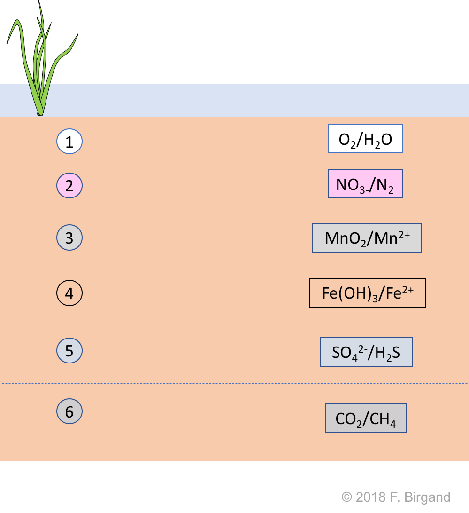
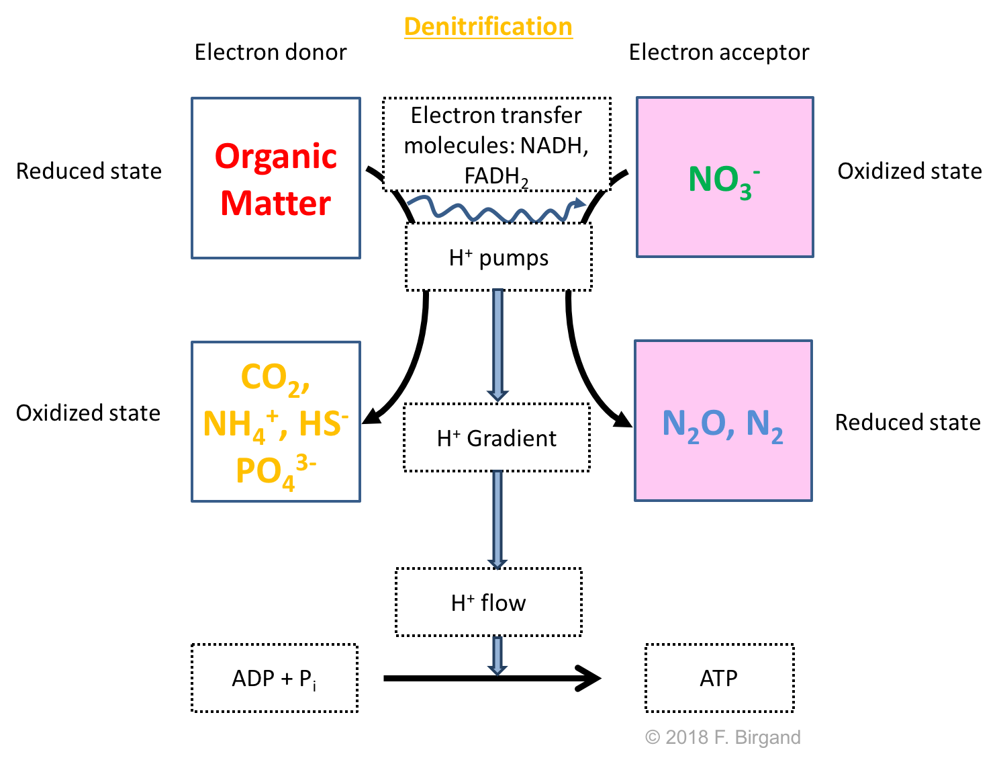
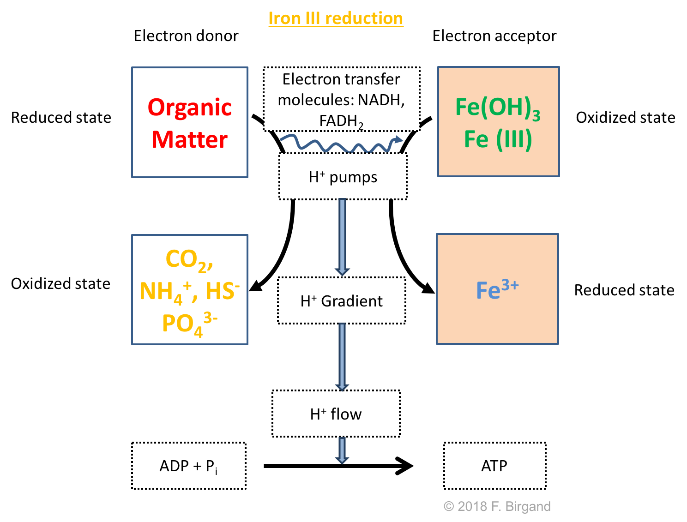
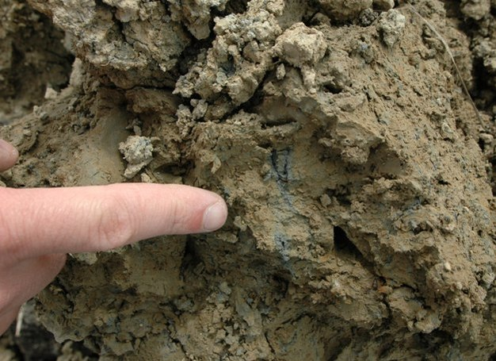
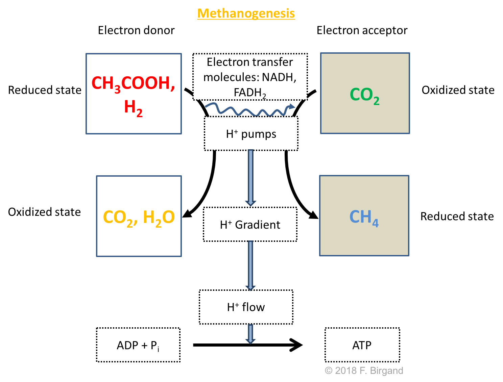
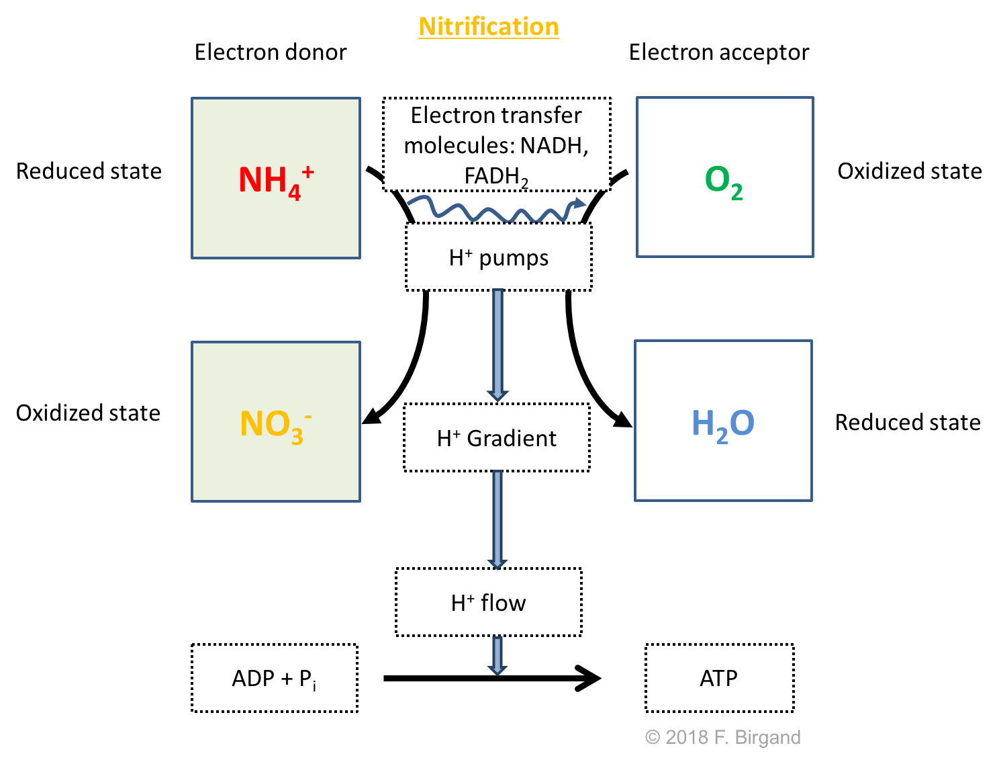
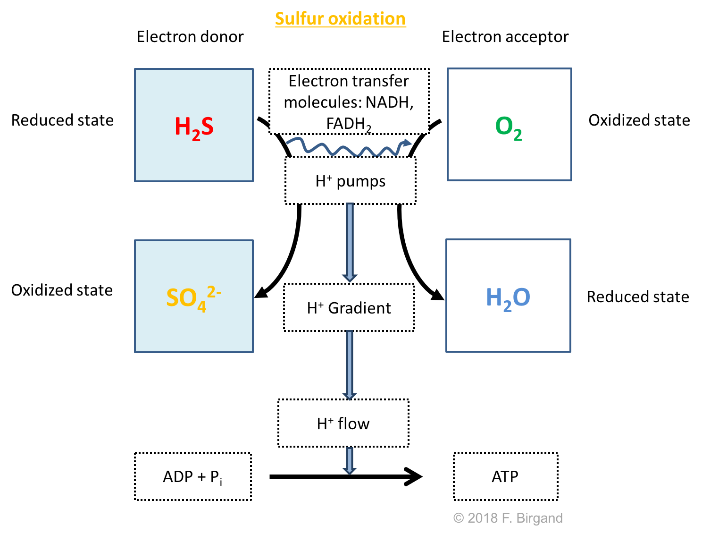
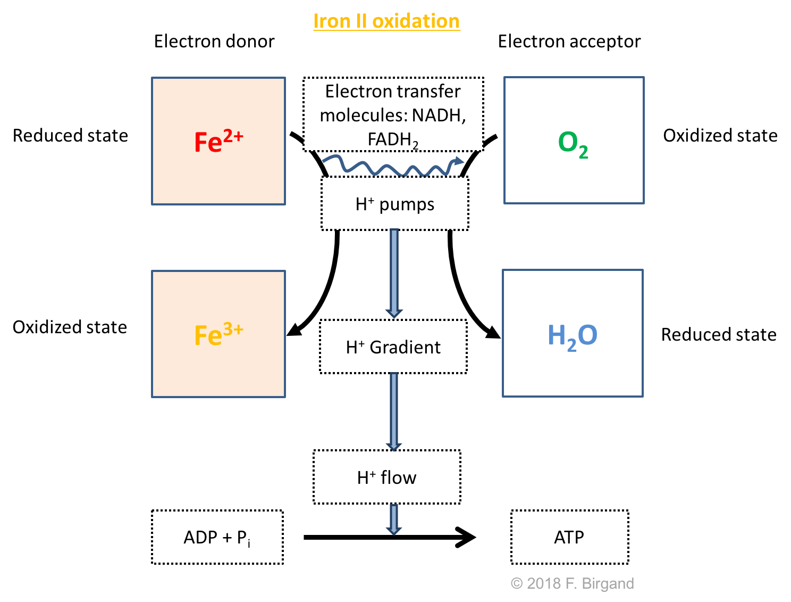
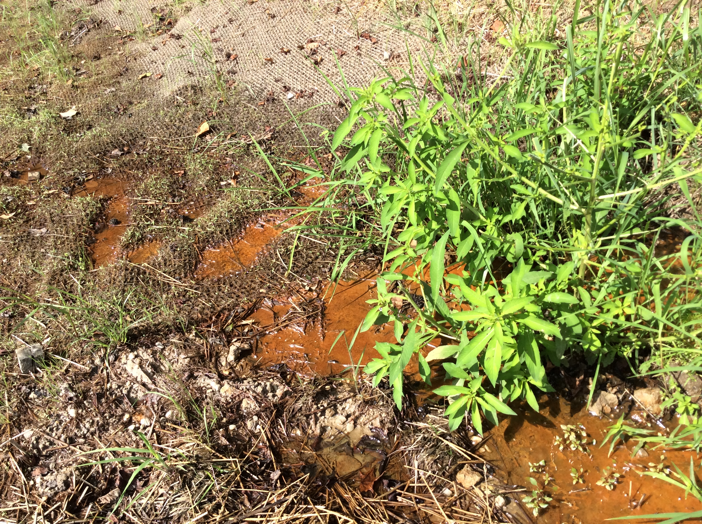

# The classic redox sequence of wetland soils

In the previous chapter, we introduced quite a few details on the molecular functioning of respiratory processes. We took aerobic respiration as our model to determine that most of the ATP produced in the cell is principally due to a proton flow from the inter-membrane space to the cytoplasm, for microbial cells and within the mitochondria for eukaryotic cells (Figure \@ref(fig:respirationglobal)). The respiration schemes provide a very handy method to summarize the important drivers and consequences of respiration: the electron donors, the electron acceptors, and the byproducts of both oxidation and reduction. In this chapter we will use the same respiration schemes to explore the processes at play in wetland soils and the consequences on concentration gradients and movement of molecules of importance in environmental and ecological engineering.

## The theoretical vertical sequence of respiratory processes in wetland soils

For this we will use a theoretical wetland soil to illustrate our point. Such theoretical soil has 'enough' organic matter content for microbial respiration to take place throughout its profile, 'enough' of other sand, silt, and clay and all the minerals that accompany them, including iron and manganese oxides. Let us assume that this theoretical soil, is sufficiently moist and aerated for microbial aerobic respiration to take place throughout the soil profile. Let us then assume that this soil is suddenly flooded, and let us explore the consequences of this. Respiratory processes are going to occur on a temporal sequence, which in fact will be mirrored by vertical sequence of processes in the wetland sediment.

## An aerobic layer near the soil-water interface

At first, all micro-organisms are going to use all the oxygen that might be present in the pore space. But because pore space is now getting filled with water, it is possible that the amount of oxygen available for microorganisms might change. And yes, indeed, water does not have nearly the capacity to provide oxygen as air does for several reasons:

- at 15&deg;C in water there are about 10 mg of O~2~ in one liter of water. Comparatively, in one liter of air, there is about 300 mg of O~2~, or __30 times__ more. How does one calculate this? At standard conditions, 1 liter of air at 21% oxygen possesses 0.21 L of oxygen. Since for these conditions, 1 mole of gas occupies 22.4 L, simply divide 0.21/22.4, to arrive at 0.0094 moles of oxygen. Then the mass of oxygen in 1 liter of air is 0.0094&times;32 g/mole = 300 mg.
- the diffusivity (which quantifies the ability of elements to move about) of O~2~ in air is 0.176 cm&sup2;/s while that of O~2~ in water is 2.10&times;10^−5^ cm&sup2;/s, or more than __8,000 times smaller__ [@Wikipedia_contributors2017-id]


In other words, it is good to remember that __the amount of oxygen available in water compared to air is about 30 less, and that oxygen in water moves almost 10,000 slower in water than in air__.

So, one can clearly see that the potential supply of oxygen from flooded porewater is thus a lot more limited than in aerated pore space. Now, where is the potential source for supply of oxygen for our recently flooded soil? The answer is the atmosphere. For a real flooded wetland soil, another source of O~2~ might be photosynthesis from algae and aquatic vegetation during the day. But in all cases, most of the oxygen needed for microbial aerobic respiration of our new flooded soil will have to travel the distance corresponding to the thickness of the water column, and, the linear distance within the porous medium of the soil, which can be quite *tortuous*. This property of the soil/sediment has been factored in by researchers and been called *tortuosity*.

__In summary__, the supply of oxygen to bacteria in a flooded soil is limited because of four factors:

1. there is about 30 times less O~2~ in water than there is in the same volume of air
2. the O~2~ diffusive transport capacity in water is about 10,000 times smaller than that in air
3. O~2~ has to travel from the atmosphere to the soil through the thickness of the water column, and
4. travel through the tortuous path of the soil porous medium

In addition to these four rules, which apply to all aquatic systems, the velocity of water matters very much in the reaeration process, which corresponds to factor 1 above: reaeration is much higher for streams than for stagnant waters. In other words, the stagnant water above our flooded wetland soil example, is another factor, compared to streams, which further limits the supply of oxygen to the aerobic bacteria in the flooded soil.

Not surprisingly, this supply is just too limited compared to the demand. As a result, most of our recently flooded soil bacteria consumes all the O~2~ and the only part of the sediment that might have a little bit of oxygen is the area at the soil-water interface. This is what it illustrated in Figure \@ref(fig:aerobic-layer-wetland-soil) below. 

```{r "aerobic-layer-wetland-soil", eval=TRUE, echo=FALSE, out.width = '95%', fig.align = 'center', fig.cap="Animation summarizing the formation of aerobic and anaerobic layers of a theoretical flooded wetland soil due to the imbalance between bacterial respiratory oxygen demand and oxygen supply through the water column"}
knitr::include_url("https://www.youtube.com/embed/hPbAfLlNuo8")
```

Because the O~2~ demand exceeds the O~2~ supply from the atmosphere and the water column, an O~2~ concentration gradient forms from the soil-water interface down. This concentration gradient, in turn, drives a downward movement of oxygen from the water column into the sediment down to the depth where there is no more concentration gradient. This depth defines the beginning of the anaerobic zone of the sediment, and above, the aerobic layer of the sediment.

## Respiration in the anaerobic zone of the soil

What happens to all the microbes in the anaerobic zone of the sediment? Certainly the exclusively aerobic microbes just do not survive, but most bacteria are facultative aerobs. In other words, they can switch from aerobic to anaerobic respiration. Let us state this again: in the anaerobic zone of the sediment, only __unicellular microorganisms are able to survive__ and have had to adapt their respiration to still be able to produce ATP for their metabolism, but using electron acceptors *other than O~2~*.

It turns out that thermodynamics dictate that not all electron acceptors can generate the same amount of energy when they strip electrons from their electron donors. As a result, one can classify electron acceptors in decreasing order from the most to the least oxidizing, and the list of preferred electron acceptors goes as such:

- nitrate or NO~3~^-^
- Manganese oxide (MnO~2~) or Mn IV
- Iron oxides/hydroxyde or Fe III
- sulfate or SO~4~^2-^
- Carbon dioxide or CO~2~

Although very different microbes are involved at the different stages, the apparent *demand* for electron acceptor, in our theoretical wetland soil, can be described as a *temporal* sequence of events: oxygen is the preferred electron acceptor; when O~2~ is all used, NO~3~^-^ will be used as the preferred electron acceptor; when all the NO~3~^-^ is used, the next most powerful electron acceptor is MnO~2~ (also referred to Mn IV; IV corresponds to its [oxidation state](#oxidation-state)), which is present in a solid or mineral form in soils; when all the MnO~2~ is used, then iron oxide or hydroxyde, which are also in the solid phase (also referred to Fe III, III corresponds to its [oxidation state](#oxidation-state)) will be used as the preferred electron acceptor; when all the Fe is used, then SO~4~^2-^ is used as the next preferred electron acceptor, and then when finally all the other electron acceptors have been all used, CO~2~ can be the ultimate electron acceptor...!

Finally, to this temporal sequence corresponds a theoretical *spatial* sequence or layers where each of the electron acceptor essentially defines a soil layer, with the layers are organized with depth from the most to the least oxidizing electron acceptor as represented in Figure \@ref(fig:wetland-soil-layers) 

```{r "wetland-soil-layers", eval=TRUE, echo=FALSE, out.width = '55%', fig.align = 'center', fig.cap="Theoretical spatial layering of wetland soils corresponding to the electron acceptor available, *not too long after flooding*. In each layer, the oxidizing and the reduced forms are illustrated as oxidizing/reduced. *Not to scale*"}

```

It is now time to present the respiration processes in each of the *redox* layer.

## A denitrification layer below the aerobic layer {#denit}

The next most powerful or oxidizing electron acceptor after O~2~ is NO~3~^-^. We have seen in the previous chapters that the N atom in nitrate has zero electron for itself, hence its ability to accept electrons. Just like for aerobic respiration, nitrate reduction just does not happen on its own. Facultative anaerobic bacteria called *denitrifiers* take advantage of the electrons available on organic matter and of nitrate to accept them to generate their energy. The denitrification of this theoretical wetland soil is referred to as [heterotrophic denitrification](#trophic-names) because the source of carbon for these denitrifiers is also the source of electron, as OM is the source of both. On a side note, there are [autolithotrophic denitrifiers](#trophic-names), which use [pyrite](https://en.wikipedia.org/wiki/Pyrite) FeS~2~ as their source of electrons, and have to find their carbon from another source than OM.

There are two possible byproducts of nitrate reduction: N~2~, which is the inert gas that makes 78% of our atmosphere, and [N~2~O](#nitrous-oxide), which is a potent [greenhouse gas](#GHG). The byproduct of the oxidation of OM are the same as the ones in aerobic heterotrophic respiration, i.e., CO~2~, NH~4~^+^, HS^-^, and PO~4~^3-^. 

```{r "denit-resp", eval=TRUE, echo=FALSE, out.width = '75%', fig.align = 'center', fig.cap="Respiration scheme for heterotrophic denitrification"}

```

In reality, you will find in textbooks that denitrification involves not a direct reduction of nitrate into N~2~ or N~2~O, but rather a sequence of reductions, summarized in equation \@ref(eq:denit-reduc-suite), where nitrite, nitrogen monoxide, and nitrous oxides are intermediate products:

\begin{equation}
NO_3^- \rightarrow NO_2^- \rightarrow NO \rightarrow N_2O \rightarrow N_2
(\#eq:denit-reduc-suite)
\end{equation}

Nitrous oxide is thus evidence of an incomplete denitrification. Because denitrification currently is the one mechanism, which removes nitrogen from the aqueous phase as gaseous byproduct, it currently ranks as the most effective ways to treat excess nitrogen in water. Entire research programs are dedicated to the development of methods and treatment systems to optimize this process. One of the active research areas is about finding ways to have denitrification go all the way to the N~2~ stage to minimize the production of N~2~O.

Because this is a reduction process, and because nitrate is *not assimilated* in the denitrifier cells, a very short and good definition of denitrification is the *microbially mediated dissimilatory reduction of nitrate into dinitrogen*. Nitrate reduction (= gains electrons) in denitrification is illustrated in the [redox half reaction](#redox) \@ref(eq:denit-half-reaction):

\begin{equation}
2 NO_3^- + 10 e^- + 12 H^+ \rightleftharpoons N_2 + 6 H_2O
(\#eq:denit-half-reaction)
\end{equation}

If you look carefully, you can see that to have the half-reaction balanced, 10 electrons were added for 2 nitrate molecules, or 5 electrons per nitrate molecule. This should ring a bell to you! Remember when we allocate electrons on N for dinitrogen and nitrate molecules, each N for dinitrogen has 5 electrons for itself, and the N of nitrate has 0 electrons for itself. So nitrogen needs to acquire 5 electrons to go from nitrate to dinitrogen. And guess what? This is exactly what half-reaction \@ref(eq:denit-half-reaction) shows! So now, if you were not convinced of the importance of the electron allocation in the early chapters, maybe you see its use now.

The overall transfer of electrons from the organic matter to NO~3~^-^, can be written as the combination of equation \@ref(eq:denit-half-reaction) and equation \@ref(eq:OM-edonor), to yield, let us admit it a rather complicated equation:

\begin{equation}
5 CH_2O + 4 NO_3^- + 4 H^+ \rightarrow 5 CO_2 + 2 N_2 + 7 H_2O
(\#eq:denit-reduc)
\end{equation}


A more complete and more descriptive definition of denitrification is

> Denitrification refers to the dissimilatory reduction, by essentially aerobic bacteria, of one or both of the ionic nitrogen oxides (nitrate, NO~3~^-^, and nitrite, NO~2~^-^) to the gaseous oxides (nitric oxide, NO, and nitrous oxide, N~2~0), which may themselves be further reduced to dinitrogen (N~2~). The nitrogen oxides act as terminal electron acceptors in the absence of oxygen. The gaseous nitrogen species are major products of these reductive processes. [@Knowles1982-ku]

Denitrification is thought to be inhibited by the presence of oxygen, and thus only occurs in our theoretical wetland soil, below the aerobic layer. However, denitrification only occurs if there is nitrate present as electron acceptor. Therefore, for denitrification to proceed, there must be a supply of nitrate that can compensate the demand due to denitrification. The only place from where nitrate can be supplied, is the water column, and, possibly, the aerobic layer of the sediment where nitrification can take place, as we shall [see later](#nitrification).

Following the same analysis as that of aerobic respiration, the demand for nitrate creates a **downward flux** of nitrate from the water column down. Because of the transport distance for nitrate from the water column and through the aerobic layer of the sediment, the supply tends to be lower than the demand. This suggests that at one point in depth there will be no more nitrate as they are consumed faster than they can diffuse downward. Nitrates thus diffuse through layer 1, and both diffuse and are consumed as electron acceptors in layer 2 in Figure \@ref(fig:wetland-soil-layers). Again, because the demand exceeds the supply, nitrates cannot move further down than the bottom of layer 2. Denitrification is thus restricted to layer 2.

## Manganese and Iron oxides reductions

Below the denitrification layer, microbes have to find new electron acceptors for their respiration. After O~2~, which is a gas, NO~3~^-^, which is a dissolved anion, the next elements which serve as electron acceptors are solids: Manganese and Iron oxides. They will serve as electron acceptors, only if soil minerals containing Mn and Fe oxides are present. In our theoretical wetland soil, the assumption is that these oxides are present. In layer 3 (Figure \@ref(fig:wetland-soil-layers)), MnO~2~ serve as the electron acceptor following the general redox half-reaction \@ref(eq:MnO2-reduc-half-reaction), and respiration scheme illustrated in Figure \@ref(fig:MnO2-resp).

\begin{equation}
MnO_2 + 4 e^- + 4 H^+ \rightleftharpoons Mn^{2+} + 2 H_2O
(\#eq:MnO2-reduc-half-reaction)
\end{equation}

The overall transfer of electrons from the organic matter to MnO~2~, i.e., the combination of equation \@ref(eq:MnO2-reduc-half-reaction) and equation \@ref(eq:OM-edonor) can be written as:

\begin{equation}
CH_2O + MnO_2 \rightarrow Mn^{2+} + CO_2 + H_2O 
(\#eq:MnO2-reduc)
\end{equation}

<br/>

```{r "MnO2-resp", eval=TRUE, echo=FALSE, out.width = '75%', fig.align = 'center', fig.cap="Respiration scheme for heterotrophic Manganese oxide reduction"}
knitr::include_graphics("pictures/respiration-OM-Mn.png")
```

While the electron donor is immobile, the reduction of MnO~2~ (equation \@ref(eq:MnO2-reduc-half-reaction)) produces Mn^2+^ ions, which are dissolved, mobile in water, and can diffuse following concentration gradients. In our original hypothesis of the sudden flooding of the wetland soil, MnO~2~ oxides would be reduced from layer 3 down. The Mn^2+^ ions produced in these layers, and the lack of Mn^2+^ ions in layers 1 and 2, would create a concentration gradient, which would generate an **upward flux** of Mn^2+^, this time, from layers 3 to 6 into layers 2 and 1. The fate of Mn^2+^ ions as they reach the aerobic layer is discussed below.

<br/>

After the MnO~2~ oxides are reduced, the iron oxides and hydroxide minerals will similarly serve as electron donors following the general equation \@ref(eq:Fe-reduc-half-reaction), and respiration scheme illustrated in Figure \@ref(fig:Fe-resp). The reduction of an iron hydroxide Fe(OH)~3~ has been added to show that in reality, Fe^3+^ never exists as such, but almost always as iron oxides or hydroxides. Many forms of [iron oxides](https://en.wikipedia.org/wiki/Iron_oxide) exist in soils, hence the choice of choosing iron hydroxide Fe(OH)~3~ in equation \@ref(eq:Fe-reduc-half-reaction). Fe^3+^, Fe(OH)~3~, and other iron oxides are referred to as *__ferric iron__* or Fe(III), because their [oxidation state](#oxidation-state) is 3. Ferric iron generally has an orange rusty color.

\begin{align}
Fe^{3+} + 1 e^- & \rightleftharpoons & Fe^{2+} \\
Fe(OH)_3 + 1 e^- + 3 H^+ & \rightleftharpoons & Fe^{2+} + 3 H_2O
(\#eq:Fe-reduc-half-reaction)
\end{align}

<br/>

The overall transfer of electrons from the organic matter to ferric iron can be written as the combination of equation \@ref(eq:Fe-reduc-half-reaction) and equation \@ref(eq:OM-edonor) to yield:

\begin{equation}
CH_2O + 4 Fe^{3+} + H_2O \rightarrow 4 Fe^{2+} + CO_2  + 4 H^+
(\#eq:Fe-reduc)
\end{equation}

<br/>

```{r "Fe-resp", eval=TRUE, echo=FALSE, out.width = '75%', fig.align = 'center', fig.cap="Respiration scheme for heterotrophic Iron oxide reduction"}

```

Similarly to Mn^2+^ ions, Fe^2+^ ions, or *__ferrous iron__*, or Fe(II) is a dissolved iron which is mobile in water, and can diffuse following concentration gradients. For the same reasons explained above for Mn^2+^, an upward concentration gradient between zones 4 to 6 and layers 3 to 1 is going to appear and the Fe^2+^ ions will tend to diffuse **upward** through layers 3 and 2. The fate of Fe^2+^ ions as they reach the aerobic layer is discussed below.

This vertical spatial sequence of layers 3 and 4 presented here probably only applies not too long after the theoretical wetland soil has been flooded. Indeed, over the long periods, the supply of ferric iron and manganese oxides will run out, as the only supply is in immobile mineral forms. So over long periods, layers 3 and 4 do not exist. Is the case of a net downward water infiltration, the Fe^2+^ and Mn^2+^ ions diffuse upward all the way into the aerobic layer, and accumulate there for reasons illustrated below. In the more likely case of small but real net downward flux of water, the dissolved ions will leach out of the soil profile. The consequences are that poorly drained soils then to leach out their iron and manganese, which is referred to as *__iron and manganese depletion__*. This is the reason for the grey color of hydric soils (Figure \@ref(fig:Fe-depletion)).

```{r "Fe-depletion", eval=TRUE, echo=FALSE, out.width = '75%', fig.align = 'center', fig.cap="Example of pale bluish gray redox depletions. Note the faint rusty orange concentration distributed throughout the soil matrix. Reproduced with permission © 2012 Nature Education All rights reserved."}

```

## Sulfate reduction

After all previous electron acceptors have been used, sulfate becomes the next electron acceptor. As we have seen before, the sulfur atom on SO~4~^2-^ has zero electrons for itself and it therefore can accept electrons following [redox half-reaction](redox-half-reactions) equation \@ref(eq:SO4-reduc-half-reaction).

\begin{equation}
SO_4^{2-} + 8 e^- + 10 H^+ \rightleftharpoons H_2S + 4 H_2O 
(\#eq:SO4-reduc-half-reaction)
\end{equation}

Here again, to balance the half-reaction, 8 electrons were needed. And by now, this should not surprise you because you now remember that the electron allocation rules tell you that on sulfate and dihydrogen sulfide, the S atom respectively has 0 and 8 electrons for itself. So the reduction of sulfate into dihydrogen sulfide requires the addition of 8 electrons, and guess what? Half-reaction \@ref(eq:SO4-reduc-half-reaction) confirms just that.

While the electron donor is still organic matter as shown in Figure \@ref(fig:SO4-resp), the overall transfer of electron from the OM to sulfate can be written as:

\begin{equation}
2 CH_2O + SO_4^{2-} + 2 H^+ \rightarrow H_2S + 2 CO_2  + 2 H_2O 
(\#eq:SO4-reduc)
\end{equation}


```{r "SO4-resp", eval=TRUE, echo=FALSE, out.width = '75%', fig.align = 'center', fig.cap="Respiration scheme for heterotrophic sulfate reduction"}
knitr::include_graphics("pictures/respiration-OM-SO4.png")
```


Typical concentrations of sulfate in ground- and stream waters are between 1 and 10 mg SO~4~^2-^/L. In our theoretical wetland soil profile, sulfate that might be originally present in the porewater will be reduced in layers 5 and 6 of Figure \@ref(fig:wetland-soil-layers). For the same reasons invoked for oxygen and nitrate, the potential source of supply for sulfate for the sulfate reducing layer is all the sulfate that might be present in the layers above and the water column. The demand for sulfate in layer 5 will create a downward concentration gradient which will generate a downward diffusive movement of sulfate down to layer 5. And again, because of all the diffusion distance, the supply of SO~4~^2-^ is limited and does not match the demand. The imbalance between the sulfate supply and demand will limit the diffusion of sulfate to the bottom of layer 5, below which there will be no more sulfate.

## The methanogenesis oddity

The last [redox](#redox) reactions to take place at the bottom of our theoretical wetland soil uses CO~2~ as the electron acceptor. Interestingly, the generic organic matter is no longer the electron donor, but is replaced by two byproducts of fermentation processes: H~2~ and acetic acid CH~3~COOH as illustrated in Figure \@ref(fig:CO2-resp).

```{r "CO2-resp", eval=TRUE, echo=FALSE, out.width = '75%', fig.align = 'center', fig.cap="Respiration scheme for the heterotrophic Carbon dioxide reduction or methanogenesis"}

```

The fermentation products are beyond the scope of this class so, we will not come back to that, but it is important to recognize that H~2~ and CH~3~COOH can donate electrons as shown in these half-reactions:

\begin{equation}
H_2 \rightleftharpoons 2H^+ + 2 e^- 
(\#eq:H2-half-reaction)
\end{equation}

and 

\begin{equation}
CH_3COOH + 2 H_2O \rightleftharpoons 2 CO_2 + 8 H^+ + 8 e^- 
(\#eq:acetic-acid-half-reaction)
\end{equation}

## First summary on the electron acceptor chain in wetland soils

- except for methanogenesis, organic matter always serves, for [organotrophs](#trophic-names), as the electron donor. Moreover, it is *__exclusively__* the Carbon of the OM which provides the electrons.
- as a result, the byproducts of the oxidation of the OM when the organic carbons lose their electrons are always the same: CO~2~, NH~4~^+^, H~2~S/HS^-^, and PO~4~^3-^ (but for methanogenesis). This means that at one point, all of these four (five if one counts both H~2~S and HS^-^, their exact proportion depends on pH, see [details in the glossary](#hydrogen-sulfide)) molecules will accumulate where they are produced unless they are used by another process
- To the contrary, the byproducts of the reduction of the electron acceptors are variable and depend on the electron acceptor. In the case of incomplete denitrification, and in the case of methanogenesis, N~2~O and CH~4~ are significant [greenhouse gases](#GHG).

## Supply and demand of electron acceptors and of the byproducts of Organic Matter oxidation

Now that we have established the reduction processes of the different electron acceptors at play, let us look at the consequences of the demands and the supplies associated with the respiratory processes. 

### Demands drive downward fluxes of dioxygen, nitrate and sulfate 

In the Figure \@ref(fig:diagenesis-diffusion-directions) below, the general directions of the fluxes of electrons acceptors and byproducts of respiration are illustrated for our theoretical wetland soil. The processes taken together is sometimes referred to as soil or sediment __diagenesis__ and all the processes in there are then collectively referred to as __diagenetic processes__.

```{r "diagenesis-diffusion-directions", eval=TRUE, echo=FALSE, out.width = '100%', fig.align = 'center', fig.cap="Diffusion fluxes of electron acceptors and all other soil diagenesis processes of a theoretical layered wetland soil"}
knitr::include_graphics("pictures/diagenesis-diffusion-directions.png")
```

The demands for dioxygen, nitrate, and sulfate in their respective layers, lower their concentrations compared to the overlying water and layers, hence the formation of concentration gradients, which then drive downward diffusive fluxes of these electron acceptors to their respective layers. These fluxes are represented as downward arrows in Figure \@ref(fig:diagenesis-diffusion-directions). 

Now, it is the imbalance between the supply from above and the demand from below, that explain why the downward diffusion does not go beyond the bottom of the respective layers 1, 2, and 5 in Figure \@ref(fig:diagenesis-diffusion-directions). The limitation of supply has been described for dioxygen in section \@ref(an-aerobic-layer-near-the-soil-water-interface). The diffusivity, distance, and tortuosity of the soil pores also apply for nitrate and sulfate, and explain why the demand is generally not met by the supply.

### Supply of byproducts of organic matter oxidation

For every respiration process described above (except for methanogenesis), the byproducts are: CO~2~, NH~4~^+^, H~2~S/HS^-^, and PO~4~^3-^. This suggests that in every single layer, there is a supply of all for of these byproducts. Inevitably, this will create an upward concentration gradient, which will then be followed by an upward flux of these four molecules in the sediment. 

Phosphate will thus dissolve upward, at least until it reaches the aerobic layer. There it might encounter soil mineral oxides where it might bind, as we shall see in future chapters, hence the tips of the arrows not reaching the soil-water interface. However, it is possible that, if the aerobic layer is very thin and the mineral oxides are scarce in this thin layer, phosphates may diffuse all the way into the water column, hence the dotted arrow.

### Nitrification

Similarly, because of ammonium production in all the layers, but that of methanogenesis, ammonium will diffuse upward, until it reaches the aerobic layer. Remember that the nitrogen atom on the ammonium carries 8 electrons for itself, so it potentially carries a lot of energy. And yes, you guessed right, microbes called __nitrifiers__ take advantage of these electrons and use __ammonium as their electron donors__, and use O~2~ as their electron acceptor. Because the electron donor this time is not an organic molecule, nitrifiers are called [lithotrophs](#trophic-names). Nitrification is represented in Figure \@ref(fig:diagenesis-diffusion-directions) as the horizontal white arrow to the left. The nitrification respiration schemes is summarized in Figure \@ref(fig:respiration-NH4-O2).

```{r "respiration-NH4-O2", eval=TRUE, echo=FALSE, out.width = '75%', fig.align = 'center', fig.cap="Respiration scheme for nitrification"}

```

Depending on the thickness of the aerobic layer and the availability of dioxygen, all or only a portion of the ammonium may get nitrified as ammonium moves upward, hence the dotted arrow going all the way to the water column. As nitrate is now produced in the aerobic layer of the soil, then the concentration gradient may sway upward or remain downward, depending on the nitrate concentration in the water column, hence the upward nitrate dotted arrow in Figure \@ref(fig:diagenesis-diffusion-directions). You may also notice that a dotted white arrow pointing the left has been added to illustrate nitrification which tends to readily occur in the water column, often thanks to nitrifiers attached at the soil-water interface.

In reality nitrification involves two stages: the oxidation of ammonium into nitrite, performed by ammonium oxidizing bacteria, of which two important genera are *Nitrosomonas* and *Nitrosococcus*, and then the oxidation of nitrite into nitrate, performed by *Nitrobacter* and *Nitrospira* bacteria (Equation \@ref(eq:nitrif)). But as far as we are concerned, both steps tend to occur almost simultaneously, and nitrite is thermodynamically unstable, and as a result very little tends to accumulate, either in soil or sediment.

\begin{equation}
NH_4^+ \rightarrow NO_2^- \rightarrow NO_3^-
(\#eq:nitrif)
\end{equation}

### Gas bubble formation

Among the last two OM oxidation byproducts, CO~2~ and H~2~S are gases. We saw earlier, that in reality the balance between H~2~S and HS^-^ [depends on the pH](#H2S). In rather organic soils, which most treatment wetland soils are, the pH tends to be rather acidic, often below 6.5. So it is fair to represent the H~2~S/HS^-^ couple as H~2~S rather than HS^-^ (see [H~2~S/HS^-^ Figure](#H2S)), hence the choice of H~2~S in Figure \@ref(fig:diagenesis-diffusion-directions) and the use of H~2~S below.

So in the end, if the summation of partial pressure of these and all other dissolved gases exceeds 1 atm + the hydraulic head, gas bubble will form and migrate upward. But because of surface tension forces, gas bubbles tend to get rather easily trapped in wetland soils and sediment. Hence the release of wetland gases when somebody or something disturbs the sediment, as we have seen in lab. To these two gases, one should add the production of CH~4~ in the methanogenesis layer, which will readily 'join' the gas bubbles and the ride with them. The dissolved fraction will also tend to move upward because of the concentration gradient. Interestingly, methane does not oxidized very well in normal aerobic conditions of wetland soils, and will therefore tend to diffuse all the way up to the water column as illustrated in Figure \@ref(fig:diagenesis-diffusion-directions).

Because of the demand for CO~2~ in the methanogenesis layer, downward arrows have been added for layers 4 and 5 in Figure \@ref(fig:diagenesis-diffusion-directions). The downward diffusion would only apply for the dissolved CO~2~ as the gaseous form would obviously tend to move upward.

### Oxidation of upward moving reduced sulfur

Similarly to ammonium, and although a good proportion of H~2~S will end up in the gas phase, a still significant amount will stay in solution and will diffuse upward until it reaches the aerobic layer. Very similarly to ammonium, H~2~S still carries 8 electrons, which can be used for respiration provided that a strong enough oxidizer be present. In the aerobic layer of the sediment, H~2~S will be oxidized back into sulfate following the respiration scheme in Figure \@ref(fig:respiration-H2S-O2)

```{r "respiration-H2S-O2", eval=TRUE, echo=FALSE, out.width = '75%', fig.align = 'center', fig.cap="Respiration scheme for hydrogen sulfide oxidation"}

```

The bacteria taking advantage of the electrons on sulfur of H~2~S are called __sulfur oxidizing bacteria__. There are different from the __sulfur reducing bacteria__ which use OM as their electron donors, and sulfate as their electron acceptors. The oxidation of H~2~S has been summarized by the white horizontal arrow in both the aerobic layer of the soil and the water column. Sulfate produced can then diffuse back downward to layer 5 in Figure \@ref(fig:diagenesis-diffusion-directions).

### Oxidation of upward moving Mn^2+^ and Fe^2+^

The last direct reduction byproducts of respiration processes include Mn^2+^ and Fe^2+^. Because they are being produced in layers 3 and below, an upward concentration gradient will be created, followed by an upward movement of Mn^2+^ and Fe^2+^. In Figure \@ref(fig:diagenesis-diffusion-directions), both of them have been represented as starting to move up from layers 4. In all logic, Mn^2+^ and Fe^2^ should start moving upward as low as layer 6 because our original hypothesis was that soil was suddenly flooded, so in the temporal sequence of electron acceptors, before sulfate carbon dioxide reduction conditions would prevail in Layers 5 and 6, respectively, the Mn and Fe oxides will serve as electron acceptors, and Mn^2+^ and Fe^2+^ will then be produced.

The more important fact is the fate of both Mn^2+^ and Fe^2+^ as they reach the aerobic layer. Because they are both reduced, they potentially have one electron to give, and yes, some bacteria have specialized in the ability to oxidize these ions. These bacteria are referred to as manganese and iron oxidizing bacteria. The respiration scheme corresponding to iron oxidation is illustrated in Figure \@ref(fig:respiration-Fe-O2) below.

```{r "respiration-Fe-O2", eval=TRUE, echo=FALSE, out.width = '75%', fig.align = 'center', fig.cap="Respiration scheme for iron oxidation"}

```

As both  Mn^2+^ and Fe^2+^ get oxidized in the aerobic layer of the sediment, they form Mn and Fe oxides, which are solids and precipitates with the other soil minerals, hence the underlying and downward pointing arrows under the MnO~2~ and Fe^3+^ in Figure \@ref(fig:diagenesis-diffusion-directions).  The precipitation of iron oxides or hydroxides can be quite visually spectacular sometimes as reduced groundwater seeps out into the open. Iron can get very quickly oxidized and form [rusty biofilms](https://photos.app.goo.gl/NUPx5DjU1QdZC09q1).

```{r "Fe-seep-CL", eval=TRUE, echo=FALSE, out.width = '75%', fig.align = 'center', fig.cap="Picture of an 'iron seep' in Goldsboro, NC, as reduced groundwater gets oxidized in contact with air"}

```

### Moving of Dissolved Organic Carbon

The last but not least of the processes at play in diagenesis is the formation and diffusion of Dissolved Organic Carbon in poorly or anoxic soils. This is the subject of a future chapter.

This concludes this long chapter on the importance respiration processes occurring in wetland soils.

